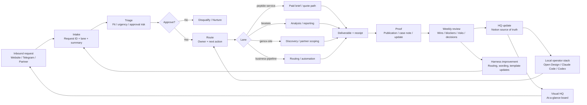

# Brown Biotech Integrated Operating Diagram

## Purpose
Show the full Brown Biotech operating loop in one diagram: intake, routing, execution, proof, and review.

## System

## Operating layers
### 1) Intake layer
- Request arrives
- Request ID is created
- Lane is selected
- Approval need is flagged

### 2) Routing layer
- One owner is assigned
- One next action is assigned
- High-stakes items go to human approval

### 3) Execution layer
- Use the right local tool for the task
- Keep the primary motion explicit: `Paid Brief → peptide-service`

### 4) Proof layer
- Convert delivery into a proof asset
- Reuse proof in the next intake or partner conversation

### 5) Review layer
- Capture what changed
- Keep weekly review and decision log current
- Move stable patterns into templates

## Rules
- One brief
- One owner
- One next action
- Human approval for high-stakes actions
- Keep Notion as source of truth
- Keep the visual board readable in under a minute

## Bottom line
Brown Biotech grows when inbound requests are turned into routed work, routed work becomes proof, and proof improves the next brief.
