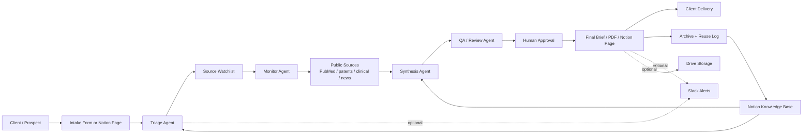

# Brown Biotech Agentic AI Launch Package

## 1) Notion Page Format

### Page title
**Brown Biotech — Agentic AI Launch OS**

### Page purpose
Track the 30-day launch plan, service offer, pipeline, delivery workflow, and client learnings in one operating hub.

### Suggested structure

#### A. Snapshot
- **Offer:** Biotech Competitive Intelligence + Literature Radar
- **Target customer:** biotech founders, BD teams, research leads, boutique funds
- **Status:** pilot / live / scaling
- **Primary KPI:** paid pilot closed
- **Secondary KPI:** turnaround time per brief

#### B. Problem Statement
- What expensive problem are we solving?
- Why now?
- Why Brown Biotech?

#### C. Offer
- One-line promise
- What is included
- What is excluded
- Delivery cadence
- Pilot pricing

#### D. Client Intake
- Company / team name
- Contact person
- Target disease / target / competitor set
- Required sources
- Priority questions
- Timeline
- Budget range

#### E. Workflow
1. intake received
2. scope review
3. source list created
4. monitoring begins
5. synthesis draft generated
6. human review
7. final delivery
8. archive in Notion

#### F. Delivery Template
- Executive summary
- What changed this week
- Why it matters
- Risks / uncertainties
- Recommended next actions
- Source list

#### G. Pipeline
- lead name
- stage
- next action
- expected value
- due date

#### H. Learnings
- what clients asked for
- which deliverables were used
- what caused delays
- what to automate next

---

## 2) Landing Page Copy

### Hero headline
**Research-ready biotech intelligence, delivered with human review.**

### Subheadline
Brown Biotech helps biotech teams track important papers, competitors, and signals without drowning in manual monitoring. We use AI to accelerate research, and humans approve what matters.

### Primary CTA
**Request a Brief**

### Secondary CTA
**View Services**

### Supporting bullets
- weekly insight briefs for defined biotech target spaces
- public-source monitoring across papers, patents, and clinical signals
- human-controlled review before every client-facing output
- built for founders, BD teams, and research leaders

### Value section headline
**Turn scattered updates into decision-ready insight.**

### Value section body
Most biotech teams do not need more noise. They need a disciplined system that collects signals, clusters what matters, and delivers a short brief they can act on.

### How it works
1. Define your target space
2. We build the watchlist
3. The agent monitors public sources
4. We synthesize the signal
5. A human reviews the brief
6. You receive a clear next-step summary

### Trust section headline
**AI-first, human-controlled.**

### Trust section body
AI speeds up the work. People approve the output. That means better speed without sacrificing judgment, accuracy, or trust.

### Service card copy

#### Biotech Competitive Intelligence + Literature Radar
Weekly briefs on papers, patents, clinical signals, and competitor moves.

#### SBIR / Grant Copilot
Drafts, outlines, reviewer-style critique, and deadline-driven grant support.

#### Proposal / Due Diligence Readiness
Evidence-backed preparation for fundraising, partnerships, and diligence.

### Final CTA section
**Start with a pilot brief.**

If you have a target area to track, we can set up a scoped pilot and deliver your first brief quickly.

### Footer line
**Brown Biotech Inc. — AI-first, human-controlled biotech operations.**

---

## 3) MVP Architecture Diagram

### Architecture notes
- **Notion** is the operating hub and knowledge store.
- **Intake** can live on the website or directly in Notion.
- **Agents** are split by function so the workflow stays reviewable.
- **Human approval** is mandatory before delivery.
- **Archive** every result so future briefs reuse prior context.
- Keep the system thin: one primary LLM, one fallback, simple orchestration.

---

## 4) Next build step
If you want to ship fast, implement in this order:
1. intake form
2. Notion record creation
3. source watchlist storage
4. brief generation
5. human review gate
6. final delivery + archive

---

## 5) Short internal memo
**Start with Biotech Competitive Intelligence + Literature Radar.**
It is the fastest path to a paid pilot because it uses public data, solves a recurring pain, and fits Brown Biotech’s research-ready brand.
